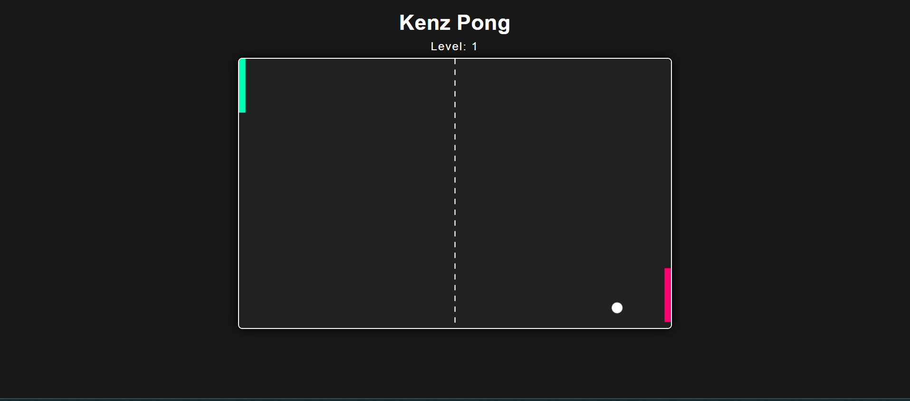

# Kenz Pong

Kenz Pong is a simple browser-based Pong game built with HTML, CSS, and JavaScript. The player controls the left paddle using their mouse, while the right paddle is controlled by a basic AI. Progress through 5 increasingly challenging levels, with the ball's speed increasing each round. If you miss the ball, the game ends. Can you beat the AI and conquer all 5 levels?

## Features

- Classic Pong gameplay in your browser
- Mouse-controlled left paddle for intuitive play
- AI-controlled right paddle that follows the ball
- Ball bounces off paddles and walls with realistic physics
- 5 Levels: Each level increases the ball's speed
- Game Over screen if you miss the ball
- "You Win!" screen after conquering level 5
- Restart button to play again

## How to Play

1. **Move your mouse** up and down over the game area to control the left paddle.
2. **Keep the ball in play** by bouncing it off your paddle.
3. **Progress through levels** by making the AI miss the ball.
4. **Win** by reaching and completing level 5.
5. **Restart** at any time after game over or victory.

## Installation

1. Clone or download this repository.
2. Open `index.html` in your favorite browser.

## Project Structure

```
kenz-pong/
│
├── index.html      # Main HTML file
├── style.css       # Game styling
├── game.js         # Game logic
└── README.md       # Project documentation
```

## Screenshot



## License

This project is released under the MIT License.

---

Enjoy playing **Kenz Pong**!  
Pull requests and suggestions are welcome.
